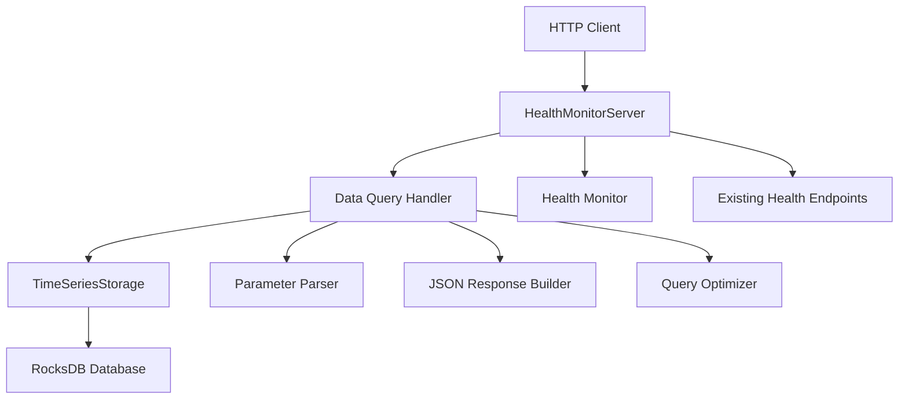

# Design Document

## Overview

The HTTP Data API extends the existing HealthMonitorServer to provide data query endpoints for accessing stored sensor data. This design leverages the existing HTTP server infrastructure while adding new endpoints for data retrieval, maintaining the same security and performance characteristics.

## Architecture

### High-Level Architecture



### Integration with Existing System

The HTTP Data API will be integrated into the existing `HealthMonitorServer` class by:

1. **Extending Request Routing**: Adding new URL patterns for data endpoints
2. **Reusing HTTP Infrastructure**: Leveraging existing socket handling and HTTP parsing
3. **Adding Storage Access**: Providing the server with access to `TimeSeriesStorage`
4. **Maintaining Security**: Using the same security model and configuration

## Components and Interfaces

### 1. Extended HealthMonitorServer

**New Constructor Parameters:**
```cpp
class HealthMonitorServer {
public:
    HealthMonitorServer(HealthMonitor* health_monitor, 
                       TimeSeriesStorage* storage = nullptr);
    
private:
    TimeSeriesStorage* storage_;
    
    // New request handlers
    std::string handle_recent_data_request(const std::string& request) const;
    std::string handle_range_data_request(const std::string& request) const;
    std::string handle_aggregates_request(const std::string& request) const;
    std::string handle_data_info_request(const std::string& request) const;
};
```

### 2. Data Query Methods in TimeSeriesStorage

**New Methods to Add:**
```cpp
class TimeSeriesStorage {
public:
    // Get recent readings (newest first)
    std::vector<SensorData> get_recent_readings(int count = 100) const;
    
    // Get readings in time range
    std::vector<SensorData> get_readings_in_range(
        std::chrono::system_clock::time_point start,
        std::chrono::system_clock::time_point end,
        int max_results = 10000) const;
    
    // Get database information
    struct DatabaseInfo {
        uint64_t total_records;
        uint64_t database_size_bytes;
        std::chrono::system_clock::time_point earliest_timestamp;
        std::chrono::system_clock::time_point latest_timestamp;
        std::string database_path;
        bool is_healthy;
    };
    DatabaseInfo get_database_info() const;
    
private:
    // Helper methods for efficient queries
    std::string get_start_key() const;
    std::string get_end_key() const;
    std::unique_ptr<rocksdb::Iterator> create_iterator() const;
};
```

### 3. HTTP Request Processing

**URL Parameter Parsing:**
```cpp
struct QueryParameters {
    std::optional<int> count;
    std::optional<std::string> start_time;
    std::optional<std::string> end_time;
    std::optional<std::string> interval;
    
    static QueryParameters parse_url_parameters(const std::string& request);
    std::chrono::system_clock::time_point parse_iso8601(const std::string& time_str) const;
};
```

**JSON Response Generation:**
```cpp
class JsonResponseBuilder {
public:
    static std::string create_readings_response(const std::vector<SensorData>& readings);
    static std::string create_range_response(const std::vector<SensorData>& readings,
                                           const std::string& start_time,
                                           const std::string& end_time);
    static std::string create_aggregates_response(const std::vector<AggregateData>& aggregates,
                                                const std::string& start_time,
                                                const std::string& end_time,
                                                const std::string& interval);
    static std::string create_info_response(const TimeSeriesStorage::DatabaseInfo& info);
    static std::string create_error_response(int status_code, const std::string& error_msg,
                                           const std::string& details = "");
    
private:
    static std::string sensor_data_to_json(const SensorData& reading);
    static std::string timestamp_to_iso8601(std::chrono::system_clock::time_point timestamp);
};
```

### 4. Data Aggregation

**Aggregation Logic:**
```cpp
struct AggregateData {
    std::chrono::system_clock::time_point timestamp;
    
    struct ValueStats {
        double mean;
        double min;
        double max;
        uint64_t count;
        bool has_data;
    };
    
    ValueStats co2_ppm;
    ValueStats temperature_c;
    ValueStats humidity_percent;
};

class DataAggregator {
public:
    static std::vector<AggregateData> aggregate_by_interval(
        const std::vector<SensorData>& readings,
        const std::string& interval);
    
private:
    static std::chrono::minutes parse_interval(const std::string& interval);
    static AggregateData aggregate_readings(const std::vector<SensorData>& readings,
                                          std::chrono::system_clock::time_point interval_start);
};
```

## Data Models

### HTTP Request/Response Formats

**Recent Readings Response:**
```json
{
  "readings": [
    {
      "timestamp": "2024-01-01T12:00:00.000Z",
      "co2_ppm": 410.5,
      "temperature_c": 22.1,
      "humidity_percent": 45.2,
      "quality_flags": 7
    }
  ],
  "total_count": 100
}
```

**Range Query Response:**
```json
{
  "readings": [...],
  "start_time": "2024-01-01T12:00:00.000Z",
  "end_time": "2024-01-01T13:00:00.000Z",
  "total_count": 3600
}
```

**Aggregates Response:**
```json
{
  "aggregates": [
    {
      "timestamp": "2024-01-01T12:00:00.000Z",
      "co2_ppm_mean": 410.5,
      "co2_ppm_min": 405.0,
      "co2_ppm_max": 415.0,
      "co2_ppm_count": 3600,
      "temperature_c_mean": 22.1,
      "temperature_c_min": 21.8,
      "temperature_c_max": 22.4,
      "temperature_c_count": 3600,
      "humidity_percent_mean": 45.2,
      "humidity_percent_min": 44.0,
      "humidity_percent_max": 46.5,
      "humidity_percent_count": 3600
    }
  ],
  "start_time": "2024-01-01T00:00:00.000Z",
  "end_time": "2024-01-02T00:00:00.000Z",
  "interval": "1H",
  "total_intervals": 24
}
```

**Database Info Response:**
```json
{
  "total_records": 1000000,
  "database_path": "/var/lib/sensor-daemon/data",
  "earliest_timestamp": "2024-01-01T00:00:00.000Z",
  "latest_timestamp": "2024-01-01T23:59:59.000Z",
  "database_size_bytes": 52428800,
  "implementation": "RocksDB via HTTP API"
}
```

## Error Handling

### Error Response Format
```json
{
  "error": "Invalid count parameter",
  "details": "Count must be positive integer",
  "timestamp": "2024-01-01T12:00:00.000Z"
}
```

### Error Categories

1. **Parameter Validation Errors (400)**
   - Invalid count values
   - Malformed timestamps
   - Invalid interval formats

2. **Resource Errors (503)**
   - Database unavailable
   - Storage engine unhealthy

3. **Rate Limiting Errors (429)**
   - Too many requests
   - Query result size exceeded

4. **Internal Errors (500)**
   - Database query failures
   - JSON serialization errors

## Security Considerations

### Input Validation
- Validate all numeric parameters (count, timestamps)
- Sanitize string inputs to prevent injection
- Limit query result sizes to prevent DoS

### Access Control
- Bind to localhost by default
- Consider adding authentication for remote access
- Implement rate limiting per client IP

### Resource Protection
- Set maximum query result limits
- Implement query timeouts
- Monitor memory usage during large queries

## Performance Optimizations

### Query Efficiency
- Use RocksDB reverse iterators for recent data
- Implement efficient range scans with seek operations
- Cache frequently requested recent readings

### Memory Management
- Stream large result sets instead of loading all into memory
- Implement pagination for very large queries
- Use move semantics for data transfer

### Concurrent Access
- Use read-only database access for queries
- Ensure thread-safe access to storage engine
- Minimize lock contention with data collection

## Implementation Strategy

### Phase 1: Basic Endpoints
1. Extend HealthMonitorServer constructor to accept TimeSeriesStorage
2. Add basic query methods to TimeSeriesStorage
3. Implement /data/recent endpoint
4. Add parameter parsing and JSON response generation

### Phase 2: Advanced Queries
1. Implement /data/range endpoint with time parsing
2. Add /data/info endpoint for database information
3. Implement proper error handling and HTTP status codes

### Phase 3: Aggregation
1. Implement data aggregation logic
2. Add /data/aggregates endpoint
3. Support different time intervals

### Phase 4: Optimization
1. Add result caching for recent queries
2. Implement query timeouts and rate limiting
3. Add performance monitoring and metrics

This design maintains compatibility with the existing system while providing the data access capabilities needed for Python client integration.