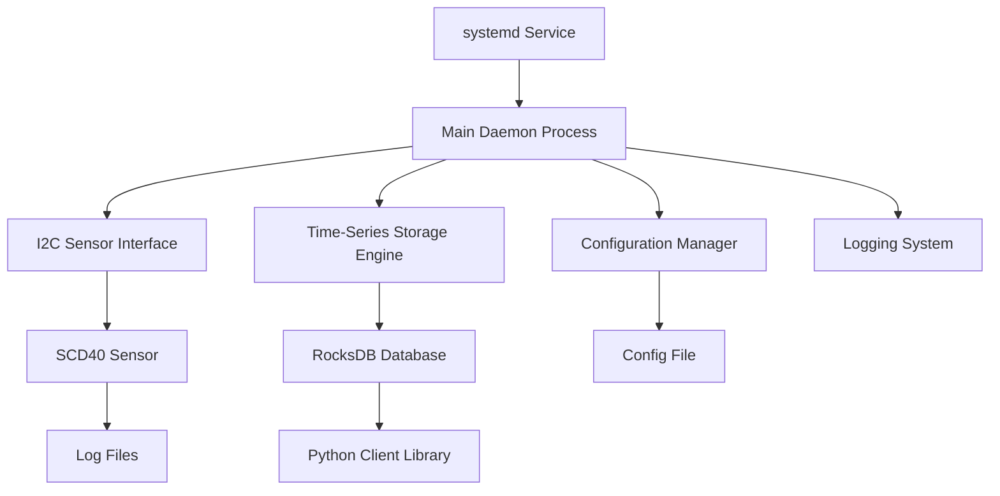

# Design Document

## Overview

The sensor data daemon is a lightweight C++20 application that continuously reads SCD40 sensor data over I2C and stores it in an efficient time-series format. The system prioritizes minimal resource usage, fast query performance, and robust operation as a Linux daemon with systemd integration.

## Architecture

### High-Level Architecture



### Core Components

1. **Daemon Core**: Main event loop and process management
2. **I2C Interface**: SCD40 sensor communication  
3. **Storage Engine**: RocksDB-based time-series data storage
4. **Configuration Manager**: Runtime configuration handling
5. **Logging System**: Structured logging with rotation
6. **Python Library**: Direct RocksDB read access for data queries

## Components and Interfaces

### 1. Daemon Core (`DaemonCore`)

**Responsibilities:**
- Process daemonization and signal handling
- Main event loop coordination
- Resource management and cleanup
- Error recovery and restart logic

**Key Methods:**
```cpp
class DaemonCore {
public:
    bool initialize(const std::string& config_path);
    void run();
    void shutdown();
    
private:
    void setup_signal_handlers();
    void daemonize();
    void main_loop();
};
```

### 2. I2C Sensor Interface (`SCD40Interface`)

**Responsibilities:**
- I2C communication with SCD40 sensor
- Data validation and error handling
- Retry logic with exponential backoff

**Key Methods:**
```cpp
struct SensorReading {
    std::chrono::system_clock::time_point timestamp;
    std::optional<float> co2_ppm;
    std::optional<float> temperature_c;
    std::optional<float> humidity_percent;
};

class SCD40Interface {
public:
    bool initialize(uint8_t i2c_address, const std::string& device_path);
    SensorReading read_sensor();
    bool is_connected() const;
    
private:
    void retry_connection();
    bool validate_reading(const SensorReading& reading);
};
```

### 3. Time-Series Storage Engine (`TimeSeriesStorage`)

**Storage Format Decision:**
RocksDB provides an excellent foundation for time-series data with the following advantages:

- **Proven Performance**: Optimized for high-throughput writes and range queries
- **Built-in Features**: Compression, compaction, crash recovery, and memory management
- **Time-Series Optimization**: Efficient range scans and prefix-based queries
- **Operational Benefits**: Reduced custom code, better reliability, and easier maintenance

**Key Design:**
- **Key Format**: `timestamp_microseconds` (8-byte big-endian for proper ordering)
- **Value Format**: Protocol Buffers for efficient serialization and schema evolution
- **Column Families**: Separate column family for metadata and configuration
- **Compaction**: Time-based TTL for automatic data cleanup

**Data Record Structure:**
```protobuf
syntax = "proto3";

message SensorReading {
    uint64 timestamp_us = 1;
    optional float co2_ppm = 2;
    optional float temperature_c = 3;
    optional float humidity_percent = 4;
    uint32 quality_flags = 5;
}
```

**Key Methods:**
```cpp
class TimeSeriesStorage {
public:
    bool initialize(const std::string& data_directory);
    bool store_reading(const SensorReading& reading);
    bool is_healthy() const;
    void cleanup_old_data();
    
private:
    std::unique_ptr<rocksdb::DB> db_;
    rocksdb::Options get_db_options();
    std::string timestamp_to_key(std::chrono::system_clock::time_point timestamp);
};
```

### 4. Python Interface (Direct RocksDB Access)

**Access Method:**
Python library directly opens the RocksDB database in read-only mode. RocksDB supports multiple concurrent readers safely, eliminating the need for a custom query server.

**Benefits:**
- No custom IPC protocol to maintain
- Eliminates potential query server bugs/crashes
- Simpler architecture with fewer moving parts
- Better performance (no serialization overhead)
- More reliable (direct database access)

**Python Implementation:**
```python
import rocksdb
import pandas as pd
from sensor_daemon.proto import sensor_pb2

class SensorDataReader:
    def __init__(self, db_path: str):
        self.db = rocksdb.DB(db_path, rocksdb.Options(), read_only=True)
    
    def get_recent_readings(self, count: int) -> pd.DataFrame:
        # Direct RocksDB reverse iteration
        pass
    
    def get_readings_range(self, start: datetime, end: datetime) -> pd.DataFrame:
        # Direct RocksDB range query
        pass
```

### 5. Configuration Manager (`ConfigManager`)

**Configuration Format:** TOML for human readability and C++ library support

**Sample Configuration:**
```toml
[daemon]
sampling_interval_seconds = 30
data_retention_days = 365
log_level = "info"

[sensor]
i2c_device = "/dev/i2c-1"
i2c_address = 0x62
connection_timeout_ms = 1000
max_retries = 3

[storage]
data_directory = "/var/lib/sensor-daemon"
file_rotation_hours = 24
compression_enabled = true
max_memory_cache_mb = 5
```

## Data Models

### Core Data Structures

```cpp
// Configuration structure
struct DaemonConfig {
    struct {
        std::chrono::seconds sampling_interval{30};
        std::chrono::hours data_retention{24 * 365};
        std::string log_level{"info"};
    } daemon;
    
    struct {
        std::string i2c_device{"/dev/i2c-1"};
        uint8_t i2c_address{0x62};
        std::chrono::milliseconds connection_timeout{1000};
        int max_retries{3};
    } sensor;
    
    struct {
        std::string data_directory{"/var/lib/sensor-daemon"};
        std::chrono::hours file_rotation{24};
        bool compression_enabled{true};
        size_t max_memory_cache_mb{5};
    } storage;
    
    // No query server configuration needed - Python accesses RocksDB directly
};
```

## Error Handling

### Error Categories

1. **Recoverable Errors**: I2C communication failures, temporary file system issues
   - Strategy: Retry with exponential backoff, continue operation
   - Logging: Warning level with retry count

2. **Configuration Errors**: Invalid config values, missing files
   - Strategy: Use defaults where possible, fail fast for critical errors
   - Logging: Error level with specific validation messages

3. **System Errors**: Out of memory, disk full, permission denied
   - Strategy: Graceful degradation or controlled shutdown
   - Logging: Critical level with system context

### Error Recovery Mechanisms

```cpp
class ErrorHandler {
public:
    enum class ErrorSeverity { Recoverable, Warning, Critical };
    
    void handle_error(const std::exception& e, ErrorSeverity severity);
    bool should_retry(const std::string& operation, int attempt_count);
    std::chrono::milliseconds get_backoff_delay(int attempt_count);
    
private:
    void log_error(const std::exception& e, ErrorSeverity severity);
    void update_health_metrics(ErrorSeverity severity);
};
```

## Testing Strategy

### Unit Testing
- **Framework**: Google Test (gtest)
- **Coverage**: All core classes with mock dependencies
- **Focus Areas**: Data validation, error handling, configuration parsing

### Integration Testing
- **I2C Interface**: Mock sensor for automated testing
- **Storage Engine**: Temporary directories for file operations
- **Query Interface**: Socket communication testing

### System Testing
- **Daemon Lifecycle**: Start, stop, restart, signal handling
- **Resource Usage**: Memory and CPU monitoring during extended runs
- **Data Integrity**: Verification of stored vs. retrieved data

### Performance Testing
- **Query Performance**: Verify <10ms response time for recent data queries
- **Memory Usage**: Confirm <10MB RAM usage under normal operation
- **Storage Efficiency**: Measure compression ratios and file sizes

## Build System and Dependencies

### CMake Structure
```cmake
# Minimum required dependencies
find_package(PkgConfig REQUIRED)
pkg_check_modules(SYSTEMD REQUIRED libsystemd)

# Third-party libraries
find_package(RocksDB REQUIRED)     # Time-series storage
find_package(Protobuf REQUIRED)    # Data serialization
find_package(spdlog REQUIRED)      # Logging
find_package(toml11 REQUIRED)      # Configuration parsing
find_package(nlohmann_json REQUIRED) # JSON for query protocol

# Optional dependencies
find_package(GTest)                # Testing (optional)
```

### Debian Package Dependencies
```
Depends: libc6, libgcc-s1, libstdc++6, libsystemd0, librocksdb-dev, libprotobuf-dev
Build-Depends: cmake, g++, libsystemd-dev, libspdlog-dev, nlohmann-json3-dev, librocksdb-dev, protobuf-compiler
```

## Deployment and Operations

### Systemd Service Configuration
```ini
[Unit]
Description=Sensor Data Collection Daemon
After=network.target
Wants=network.target

[Service]
Type=notify
ExecStart=/usr/bin/sensor-daemon --config /etc/sensor-daemon/config.toml
Restart=always
RestartSec=10
User=sensor-daemon
Group=sensor-daemon
PrivateTmp=true
ProtectSystem=strict
ReadWritePaths=/var/lib/sensor-daemon /var/run/sensor-daemon

[Install]
WantedBy=multi-user.target
```

### File System Layout
```
/usr/bin/sensor-daemon              # Main executable
/etc/sensor-daemon/config.toml      # Configuration file
/var/lib/sensor-daemon/             # Data storage directory
/var/run/sensor-daemon/             # Runtime files (socket)
/var/log/sensor-daemon/             # Log files
/usr/lib/python3/dist-packages/sensor_daemon/  # Python module
```

## Python Interface Design

### Python Module Structure
```python
# sensor_daemon/__init__.py
class SensorDataReader:
    def __init__(self, db_path="/var/lib/sensor-daemon/data"):
        """Direct RocksDB access - no daemon communication needed"""
        pass
    
    def get_recent_readings(self, count: int) -> pd.DataFrame:
        """Get the last N sensor readings via direct DB access"""
        pass
    
    def get_readings_range(self, start: datetime, end: datetime) -> pd.DataFrame:
        """Get readings within a time range via direct DB access"""
        pass
    
    def get_aggregates(self, start: datetime, end: datetime, 
                      interval: str = "1H") -> pd.DataFrame:
        """Compute aggregated statistics from raw data"""
        pass
    
    def is_daemon_running(self) -> bool:
        """Check if daemon process is running via systemd"""
        pass
```

This design provides a solid foundation for a resource-efficient, robust sensor data collection system that meets all the specified requirements while remaining simple and maintainable.